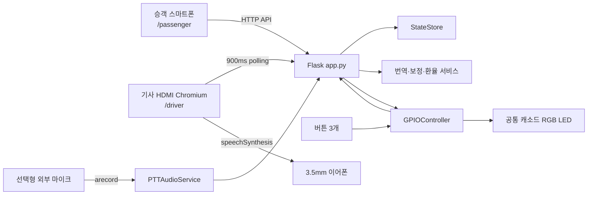

# RideBridge Lite

Raspberry Pi 4와 승객 스마트폰을 연결해 택시 기사와 외국인 승객의 의사소통을
돕는 4개 국어 승차 지원 시스템이다. 승객 메시지를 기사 화면에 한국어로
전달하고, 기사 응답을 승객 언어로 번역한다. 물리 버튼과 RGB LED는 운전 중
화면 조작을 줄이는 보조 인터페이스로 사용한다.

- 제출 버전: `1.0.0`
- 지원 언어: 한국어, 영어, 일본어, 중국어
- 대상 장치: Raspberry Pi 4 Model B / Raspberry Pi OS
- 기사 출력: HDMI 화면 + 3.5mm 이어폰 TTS
- 상세 제출 보고서: [`docs/submission_report_ko.md`](docs/submission_report_ko.md)
- 촬영 대본: [`docs/video_scenario_ko.md`](docs/video_scenario_ko.md)

## 1. 구현 완료 범위

| 영역 | 구현 상태 | 설명 |
| --- | --- | --- |
| 승객 모바일 웹 | 완료 | 언어 선택, 자유 문장, 빠른 문장, 가이드, 환율, 1330 연결 |
| 기사 HDMI 웹 | 완료 | 번역 표시/TTS, 확인, 다시듣기, 답변, Quick-Bar, 상태 표시 |
| 양방향 번역 | 완료 | MyMemory API, 실패 시 로컬 빠른 문장 유지 및 오류 표시 |
| 4개 국어 UI | 완료 | 승객 핵심 화면과 STT 안내를 KO/EN/JA/ZH로 전환 |
| GPIO 확인 버튼 | 완료 | 최신 승객 요청 확인, 승객 언어 확인 메시지 전송 |
| GPIO 다시듣기 | 완료 | 최신 한국어 요청을 기사 브라우저 TTS로 재생 |
| GPIO PTT 이벤트 | 완료 | press/release 상태 전달, 외부 입력 사용 시 ALSA 녹음·STT |
| RGB 상태 LED | 완료 | 초록/파랑/빨강 및 비동기 점멸, 공통 캐소드 지원 |
| GPIO 호환성 | 완료 | `gpiozero` 우선, 실패 시 `rpi-lgpio` 자동 전환 |
| 3.5mm 이어폰 | 완료 | 시스템 기본 Analog/Headphones 출력으로 TTS 재생 |
| STT 권한 처리 | 완료 | HTTPS/지원 여부 감지, `not-allowed` 안내, 텍스트 fallback |
| HTTPS 실행 | 완료 | 인증서·키 환경변수 지정 시 Flask TLS 실행 |
| 개발 PC fallback | 완료 | GPIO가 없어도 웹 기능과 테스트 정상 실행 |
| 진단·테스트 | 완료 | health API, preflight, 디버그 GPIO API, 자동화 테스트 |

## 2. 시스템 구조



기존 `/api/messages` polling 구조를 유지해 GPIO 이벤트도 `StateStore` 메시지로
전달한다. 웹 버튼과 물리 버튼은 각각 별도 로직을 복제하지 않고
`handle_driver_confirm()`, `handle_replay_request()`, `handle_ptt_pressed()`,
`handle_ptt_released()`를 공유한다.

## 3. GPIO 배선

코드는 BCM 번호를 사용한다. 모든 버튼은 `GPIO → 버튼 → GND`로 연결하고 Python
내부 pull-up과 80ms debounce를 사용한다. 회로도의 3.3V 레일을 버튼 신호에 직접
연결하지 않는다.

| 기능 | BCM | Physical pin | 배선/동작 |
| --- | ---: | ---: | --- |
| 확인 버튼 | 17 | 11 | 버튼 반대편 GND, 최신 요청 확인 |
| PTT 버튼 | 27 | 13 | 버튼 반대편 GND, press/release 감지 |
| 다시듣기 버튼 | 22 | 15 | 버튼 반대편 GND, 최신 한국어 TTS |
| LED Red | 5 | 29 | GPIO5 → 330Ω → LED R |
| LED Green | 6 | 31 | GPIO6 → 330Ω → LED G |
| LED Blue | 13 | 33 | GPIO13 → 330Ω → LED B |
| LED 캐소드 | GND | 6/9/25/39 | 공통 캐소드 → GND |

LED 상태는 다음과 같다.

| 상태 | LED |
| --- | --- |
| 대기/확인 완료 | 초록 |
| 승객 요청 | 파랑 |
| 외부 마이크 녹음 | 파랑 점멸 |
| 음성 처리 | 파랑 |
| 번역 연결 실패 | 빨강 |
| 시스템/녹음 오류 | 빨강 점멸 |

## 4. 3.5mm 이어폰과 PTT 설계

Raspberry Pi 4의 3.5mm TRRS 잭은 라인 레벨 **출력**이며 마이크 입력이 아니다.
따라서 기본 설정은 기사 TTS와 다시듣기 출력만 활성화하고 음성 입력은 끈다.

```text
3.5mm 이어폰        → 한국어 TTS/다시듣기 출력
3.5mm 이어폰 마이크 → 사용 불가
물리 PTT            → 입력 없음 안내, 기존 LED 상태 유지
기사 답변            → 텍스트 또는 Smart Context Quick-Bar
```

외부 USB 마이크 또는 마이크 입력이 있는 USB 오디오 어댑터를 추가하면 선택형 PTT
녹음/STT 기능을 켤 수 있다.

```bash
arecord -l
export RIDEBRIDGE_AUDIO_INPUT_ENABLED=1
export RIDEBRIDGE_AUDIO_DEVICE=plughw:1,0
./start_pi.sh
```

## 5. Raspberry Pi 설치

Raspberry Pi OS Bookworm 기준 권장 절차다.

```bash
sudo apt update
sudo apt install -y python3-full python3-dev swig liblgpio-dev alsa-utils
sudo usermod -aG gpio,audio $USER
sudo reboot
```

재부팅 후 프로젝트 전용 가상환경을 만든다. `RPi.GPIO`와 `rpi-lgpio`를 같은
가상환경에 중복 설치하지 않는다.

```bash
cd ridebridge_lite_rpi4
python3 -m venv .venv
source .venv/bin/activate
python -m pip install --upgrade pip
python -m pip install -r requirements.txt
python scripts/preflight.py --strict-hardware
```

## 6. 실행과 접속

```bash
./start_pi.sh
```

직접 실행하려면:

```bash
source .venv/bin/activate
python app.py
```

| 화면 | 주소 |
| --- | --- |
| 기사 HDMI 화면 | `http://localhost:5000/driver` |
| 승객 화면(Pi 자체) | `http://localhost:5000/passenger` |
| 승객 스마트폰 | `http://<PI_IP>:5000/passenger` |
| 상태 진단 | `http://localhost:5000/api/health` |

Pi 주소 확인:

```bash
hostname -I
```

## 7. 3.5mm 오디오 출력 선택

Raspberry Pi OS 데스크톱의 음량 메뉴에서 Analog/Headphones를 선택한다. CLI에서는
다음과 같이 기본 sink를 지정한다.

```bash
wpctl status
wpctl set-default <ANALOG_SINK_ID>
wpctl status
```

기사 Chromium의 `speechSynthesis`는 시스템 기본 출력으로 재생된다.

## 8. 브라우저 STT와 HTTPS

브라우저 마이크는 HTTPS 보안 컨텍스트(같은 장치의 `localhost` 포함)와 사용자
권한이 모두 필요하다. 스마트폰에서 단순 HTTP Pi IP로 접속하면 코드는 STT 버튼을
미리 비활성화하고 텍스트/빠른 문장을 안내한다.

유효하고 단말에서 신뢰하는 인증서가 있다면 다음과 같이 HTTPS로 실행한다.

```bash
export RIDEBRIDGE_SSL_CERT=/absolute/path/fullchain.pem
export RIDEBRIDGE_SSL_KEY=/absolute/path/privkey.pem
./start_pi.sh
```

인증서와 키 중 하나만 지정하거나 파일이 없으면 서버가 명확한 오류와 함께 실행을
중단한다. 자체 서명 인증서는 스마트폰에서 별도로 신뢰하도록 설치해야 한다.

## 9. 환경변수

| 변수 | 기본값 | 설명 |
| --- | --- | --- |
| `RIDEBRIDGE_HOST` | `0.0.0.0` | Flask listen 주소 |
| `RIDEBRIDGE_PORT` | `5000` | Flask listen 포트 |
| `RIDEBRIDGE_DEBUG` | `0` | `1`일 때만 GPIO 디버그 API 활성화 |
| `RIDEBRIDGE_AUDIO_OUTPUT` | `3.5mm` | 기사 화면 출력 상태 라벨 |
| `RIDEBRIDGE_AUDIO_INPUT_ENABLED` | `0` | 외부 마이크 PTT/STT 활성화 |
| `RIDEBRIDGE_AUDIO_DEVICE` | `default` | ALSA 입력 장치 |
| `RIDEBRIDGE_AUDIO_RATE` | `16000` | 녹음 sample rate |
| `RIDEBRIDGE_AUDIO_MAX_SECONDS` | `30` | 최대 PTT 녹음 시간 |
| `RIDEBRIDGE_AUDIO_LANGUAGE` | `ko-KR` | 기사 STT 언어 |
| `RIDEBRIDGE_SSL_CERT` | 없음 | HTTPS 인증서 절대 경로 |
| `RIDEBRIDGE_SSL_KEY` | 없음 | HTTPS 개인키 절대 경로 |

운영 기본값은 Flask 디버그 비활성이다.

## 10. 진단과 실제 버튼 시험

시스템 진단:

```bash
source .venv/bin/activate
python scripts/preflight.py --strict-hardware
curl http://localhost:5000/api/health
```

정상 Pi에서는 health 응답의 `gpio_available`이 `true`, `gpio_backend`가
`gpiozero` 또는 `rpi-lgpio`여야 한다. 오류가 있으면 `gpio_error`에서 import,
권한, 핀 점유 문제를 확인할 수 있다.

하드웨어 없이 로직을 시험하려면 디버그 모드로 실행한다.

```bash
RIDEBRIDGE_DEBUG=1 ./start_pi.sh
```

승객 요청을 먼저 전송한 후:

```bash
curl -X POST http://localhost:5000/api/debug/gpio/confirm
curl -X POST http://localhost:5000/api/debug/gpio/replay
curl -X POST http://localhost:5000/api/debug/gpio/ptt/press
curl -X POST http://localhost:5000/api/debug/gpio/ptt/release
```

실제 하드웨어 확인 순서:

1. 시작 직후 LED 초록과 `[GPIO] initialized (...)` 로그 확인
2. 승객 빠른 문장 전송 후 LED 파랑 확인
3. GPIO17을 눌러 초록 전환과 승객 확인 메시지 확인
4. GPIO22를 눌러 3.5mm 이어폰에서 최신 한국어 요청 재생 확인
5. GPIO27을 눌렀다 떼어 출력 전용 안내와 LED 상태 유지 확인
6. 외부 입력을 활성화한 구성에서는 GPIO27 press 중 파랑 점멸과 STT 결과 확인

## 11. 자동화 검증

```bash
source .venv/bin/activate
PYTHONDONTWRITEBYTECODE=1 python -m unittest discover -s tests -v
node --check static/driver.js
node --check static/passenger.js
bash -n start_pi.sh
```

자동화 테스트는 다음을 포함한다.

- 승객 번역 → 확인 → 다시듣기 전체 흐름
- 번역 실패/로컬 빠른 문장/LED 상태
- PTT 출력 전용 및 선택형 외부 입력 흐름
- `gpiozero` 핀 매핑과 `rpi-lgpio` fallback
- RGB LED active-high, debounce, cleanup
- 오디오 녹음·STT 성공/실패·임시 파일 제거
- API 입력값, 통화 코드, debug 접근 제한
- HTTPS 설정 검증, 번역 HTML entity 처리
- 제출 메타데이터와 1330 실제 링크

2026-09-02 제출 점검 결과 Python 테스트 `19/19`, JavaScript 2개 파일 문법,
shell 문법, JSON 데이터, HTTP 화면/health smoke test가 모두 통과했다. GPIO가 없는
개발 PC에서 발생한 `/dev/gpiochip0` 경고는 의도한 fallback 결과이며 실제 Pi 전압과
3.5mm 소리는 아래 실제 하드웨어 절차로 별도 확인해야 한다.

## 12. 주요 API

| Method | Endpoint | 역할 |
| --- | --- | --- |
| GET | `/api/bootstrap` | 초기 언어·문장·가이드·하드웨어 상태 |
| GET | `/api/messages?after=<id>` | 대화/GPIO 이벤트 polling |
| POST | `/api/passenger/send` | 승객 자유 문장 번역 |
| POST | `/api/passenger/quick` | 승객 로컬 빠른 문장 |
| POST | `/api/driver/send` | 기사 자유 문장 번역 |
| POST | `/api/driver/quick` | 기사 상황별 빠른 문장 |
| POST | `/api/driver/confirm` | 최신 승객 요청 확인 |
| POST | `/api/driver/replay` | 최신 한국어 요청 다시듣기 이벤트 |
| GET | `/api/currency` | KRW 환율 환산 |
| GET | `/api/health` | 버전·GPIO·오디오 진단 |

## 13. 프로젝트 구조

```text
ridebridge_lite_rpi4/
├── app.py                       # Flask API와 공통 업무 흐름
├── config.py                    # 환경변수/실행 설정
├── requirements.txt
├── start_pi.sh                  # Pi 실행 진입점
├── services/
│   ├── audio_control.py         # 선택형 ALSA PTT/STT
│   ├── gpio_control.py          # 버튼·RGB·이중 GPIO backend
│   ├── translator.py            # 양방향 번역
│   ├── corrector.py             # 사투리·고유명사 보정
│   ├── currency.py              # KRW 환율
│   ├── data_service.py          # 로컬 JSON 데이터
│   └── state.py                 # thread-safe 메모리 상태
├── templates/                   # 기사/승객 화면
├── static/                      # UI 로직과 스타일
├── data/                        # 빠른 문장·보정·가이드
├── scripts/preflight.py         # 제출/Pi 사전 진단
├── tests/test_gpio_flow.py      # 통합·GPIO·오디오 테스트
└── docs/                        # 보고서와 영상 대본
```

## 14. 시연 순서

1. 기사 화면과 승객 스마트폰 화면 접속
2. 승객 언어를 English로 선택
3. `Please drop me off here.` 빠른 문장 전송
4. 기사 화면 한국어 표시, 3.5mm TTS, 파란 LED 확인
5. 다시듣기 물리 버튼으로 TTS 재생
6. 확인 물리 버튼으로 초록 LED와 승객 확인 메시지 확인
7. 기사 Quick-Bar 또는 텍스트로 승객에게 답변
8. 가이드 카드, 환율, 1330 전화 링크 시연

전체 영상 대본은 [`docs/video_scenario_ko.md`](docs/video_scenario_ko.md)에 있다.

## 15. 한계와 확장 범위

현재 제출본에서 의도적으로 외부 범위로 남긴 항목은 다음과 같다.

- Pi 4의 3.5mm 잭에는 입력 회로가 없으므로 이어폰 마이크 녹음 불가
- 유효한 HTTPS 인증서는 배포 환경의 도메인/단말 신뢰 설정이 필요해 저장소에 미포함
- 자유문장과 환율은 공개 외부 API 연결 필요; 빠른 문장은 로컬 동작
- 메시지는 단일 운행용 메모리 상태이며 서버 재시작 시 초기화
- GPS 자동 운행 상태 전환은 센서가 없는 Lite 제출 범위에서 제외
- 실제 차량 주행 시험이 아닌 정차 환경에서만 안전하게 시연

이는 화면·GPIO·번역·fallback의 제출 기능 누락이 아니라 하드웨어 또는 운영
인프라가 필요한 확장 지점이다.

## 16. 참고 자료

- [Raspberry Pi GPIO 및 권한](https://www.raspberrypi.com/documentation/computers/raspberry-pi.html)
- [Raspberry Pi 오디오 출력 선택](https://www.raspberrypi.com/documentation/configuration/computers/raspberry-pi.html)
- [Raspberry Pi 1–4 3.5mm line-level 출력](https://www.raspberrypi.com/documentation/computers/getting-started.html?file=README.md)
- [MDN 마이크 보안 컨텍스트와 권한](https://developer.mozilla.org/en-US/docs/Web/API/MediaDevices/getUserMedia.)
- [MDN SpeechRecognition 오류](https://developer.mozilla.org/en-US/docs/Web/API/SpeechRecognitionErrorEvent/error)
- [MyMemory API 기술 문서](https://mymemory.translated.net/doc/spec.php)
- [Frankfurter v2 API](https://frankfurter.dev/)
- [한국관광공사 1330](https://english.visitkorea.or.kr/svc/contents/infoHtmlView.do?vcontsId=140632)

## 17. 제출 전 Git 확인

```bash
git status --short
git rev-list --count HEAD
git log --oneline
```

제출 상태에서는 working tree가 깨끗하고 현재 브랜치의 커밋 수가 `1`이어야 한다.
`.venv`, `__pycache__`, 인증서, 로그, WAV 및 ZIP 파일은 `.gitignore`로 제외한다.
