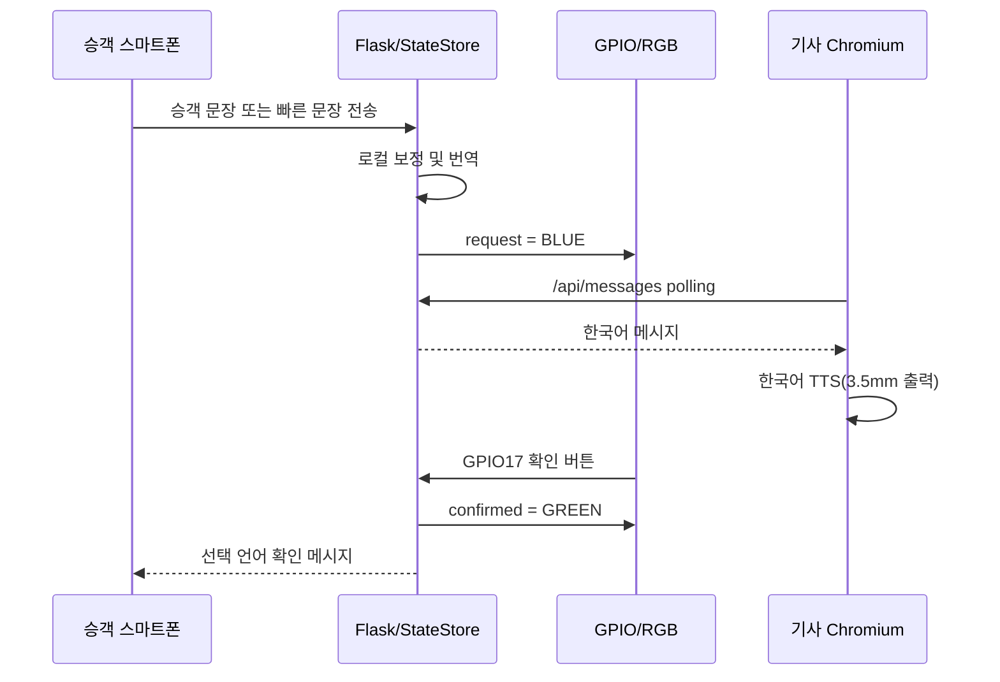

# RideBridge Lite 최종 기술 보고서

| 항목 | 내용 |
| --- | --- |
| 과제명 | Raspberry Pi 기반 다국어 택시 승차 지원 시스템 |
| 제품명 | RideBridge Lite |
| 제출 버전 | 1.0.0 |
| 작성일 | 2026-09-02 |
| 개발 환경 | Python/Flask, HTML/CSS/JavaScript, Raspberry Pi 4 |
| 작성자·팀 | 제출자가 기입 |

## 1. 초록

RideBridge Lite는 한국인 택시 기사와 외국인 승객 사이의 언어 장벽을 줄이기 위한
Raspberry Pi 기반 승차 지원 시스템이다. 승객은 별도 앱 설치 없이 스마트폰
브라우저로 접속해 한국어·영어·일본어·중국어 중 하나를 선택한다. 자유 문장이나
검수된 빠른 문장을 보내면 기사 HDMI 화면에 한국어 번역과 TTS가 제공된다. 기사는
텍스트 또는 운행 상태별 Quick-Bar로 응답하고, 물리 확인/다시듣기/PTT 버튼과 RGB
LED를 통해 화면 조작을 줄일 수 있다.

본 제출본은 GPIO가 없는 개발 PC에서도 웹 기능이 중단되지 않도록 계층을 분리했다.
Raspberry Pi에서는 `gpiozero`를 우선 사용하고 초기화 실패 시 `rpi-lgpio`로
전환한다. Pi 4의 3.5mm 잭이 출력 전용이라는 하드웨어 제약은 숨기지 않고 TTS
출력에 활용하며, 없는 마이크를 실행해 오류를 발생시키지 않도록 설계했다.

## 2. 문제 정의

외국인 승객이 택시를 이용할 때 목적지 변경, 하차 위치, 요금, 안전 요청처럼 짧고
중요한 문장이 정확히 전달되지 않을 수 있다. 일반 번역 앱은 기사와 승객이 한
기기를 번갈아 조작해야 하고, 운전 중 화면 터치는 안전하지 않다. 또한 네트워크
번역 API가 실패하면 핵심 문장까지 전달하지 못하는 문제가 있다.

따라서 다음 목표를 설정했다.

1. 승객 개인 스마트폰과 기사 전용 화면을 분리한다.
2. 기사에게 필요한 확인과 다시듣기를 물리 버튼으로 제공한다.
3. 상태를 RGB LED로 즉시 알린다.
4. 공개 번역 API 실패 시에도 검수된 빠른 문장은 동작하게 한다.
5. GPIO와 오디오가 없는 개발 환경에서도 서버 전체는 정상 동작하게 한다.
6. 실제 하드웨어 제약과 브라우저 권한 정책을 사용자에게 정확히 안내한다.

## 3. 시스템 구성

### 3.1 하드웨어

- Raspberry Pi 4 Model B
- HDMI 모니터: 기사 전용 화면
- 3.5mm 이어폰 또는 앰프 내장 스피커: 기사 한국어 TTS
- 순간 누름 버튼 3개: 확인, PTT, 다시듣기
- 공통 캐소드 RGB LED 1개
- 색상 채널별 330Ω 저항 3개
- 승객 스마트폰과 공용 Wi-Fi

### 3.2 소프트웨어

- Flask 2.2.5: 페이지와 REST API
- `StateStore`: thread-safe 운행/메시지 상태
- MyMemory: 한·영·일·중 자유문장 번역
- Frankfurter v2: KRW 환율 정보
- Web Speech API: 조건부 브라우저 STT/TTS
- ALSA `arecord` + SpeechRecognition: 선택형 외부 입력 PTT
- gpiozero / rpi-lgpio: GPIO 입력과 RGB 출력

### 3.3 데이터 흐름



## 4. 회로와 핀 설계

버튼은 내부 pull-up을 사용하므로 눌렀을 때 GPIO가 GND로 연결되는 active-low
구조다. RGB LED는 공통 캐소드이므로 각 색상 GPIO가 HIGH일 때 켜진다.

| 장치 | BCM | 물리 핀 | 설정 |
| --- | ---: | ---: | --- |
| 확인 버튼 | 17 | 11 | input, pull-up, 80ms debounce |
| PTT 버튼 | 27 | 13 | input, pull-up, press/release |
| 다시듣기 버튼 | 22 | 15 | input, pull-up, 80ms debounce |
| LED 빨강 | 5 | 29 | output, active-high, 330Ω |
| LED 초록 | 6 | 31 | output, active-high, 330Ω |
| LED 파랑 | 13 | 33 | output, active-high, 330Ω |
| LED 공통 캐소드 | GND | 6/9/25/39 | 공통 접지 |

모든 색상과 점멸 조건은 `services/gpio_control.py`의 상태 표에 모아 두어 업무
코드가 RGB 값을 직접 다루지 않게 했다. 점멸은 daemon thread로 처리해 Flask 요청
스레드를 막지 않는다.

## 5. 핵심 구현

### 5.1 공통 버튼 업무 흐름

웹 확인 버튼과 GPIO17은 `handle_driver_confirm()`을 공유한다. 최신 승객 요청을
확인 처리하고, 승객 원문 언어에 맞는 확인 메시지를 `driver_confirm` 이벤트로
저장한다. GPIO22와 웹 다시듣기도 `handle_replay_request()`를 공유하며
`hardware_replay` 이벤트를 기사 브라우저로 보내 최신 한국어 문장을 다시 읽는다.

### 5.2 GPIO 이중 backend

`GPIOController.initialize()`는 다음 순서로 동작한다.

1. gpiozero의 Button/RGBLED 초기화 시도
2. import 또는 pin factory 실패 시 생성된 장치 정리
3. RPi.GPIO API를 제공하는 rpi-lgpio 초기화 시도
4. 두 방식이 모두 실패하면 GPIO만 비활성화하고 Flask는 계속 실행
5. 종료 시 점멸 thread, 이벤트 감지, LED, GPIO 핀을 안전하게 정리

상태 API는 성공 backend와 실제 오류 문자열을 제공하므로 라이브러리·권한·핀 점유
문제를 SSH에서 확인할 수 있다.

### 5.3 번역 실패와 오프라인 빠른 문장

자유문장은 로컬 사투리/고유명사 보정을 거친 후 MyMemory에 전달한다. HTTP 오류,
서비스 오류 상태, 빈 결과를 하나의 `TranslationError`로 정규화한다. 실패 시 LED를
빨간색으로 바꾸되 Flask 서버 자체를 오프라인으로 표시하지 않는다.

빠른 문장은 `data/phrases.json`에 4개 국어로 저장되어 외부 번역 요청 없이
전달된다. 따라서 인터넷 번역 서비스가 실패해도 하차, 정차, 안전 관련 검수 문장을
사용할 수 있다.

### 5.4 3.5mm 오디오와 PTT

Pi 4의 3.5mm TRRS는 line-level audio/composite **출력**이며 마이크 입력이 아니다.
기본값에서 기사 STT와 서버 녹음은 비활성화하고, 이어폰은 브라우저 TTS와
다시듣기에 사용한다. PTT를 눌러도 오류 LED를 만들지 않고 입력 장치가 없음을
안내한다.

USB 마이크나 마이크 입력을 지원하는 USB 오디오 어댑터를 연결했을 때는 환경변수
하나로 ALSA 녹음을 활성화할 수 있다. press 시 비동기 녹음을 시작하고 release 시
WAV를 종료해 한국어 STT와 기사→승객 번역을 수행한다. 임시 WAV는 성공·실패와
관계없이 삭제한다.

### 5.5 브라우저 STT 권한

스마트폰 브라우저 마이크는 HTTPS 또는 localhost와 명시적 사용자 권한이 필요하다.
프론트엔드는 `window.isSecureContext`와 Web Speech API 지원을 시작 전에 확인한다.
사용 불가능하면 STT 버튼을 비활성화하고 현재 언어로 텍스트/빠른 문장 fallback을
안내한다. `not-allowed`와 `audio-capture`도 서로 다른 해결 문구로 표시한다.

인증서와 개인키를 환경변수로 함께 지정하면 Flask가 HTTPS로 실행된다. 키 쌍이
불완전하거나 파일이 없으면 조용히 HTTP로 내려가지 않고 명확히 실패한다.

### 5.6 다국어 승객 UI와 인적 지원

언어 변경 시 문장 데이터뿐 아니라 제목, 버튼, placeholder, STT 오류, 환율 진행
문구와 1330 안내가 한국어·영어·일본어·중국어로 전환된다. 승객과 기사 화면의
1330 버튼은 실제 `tel:1330` 링크다. 1330은 자동 번역이 해결하기 어려운 관광 문의
및 통역을 위한 인적 fallback이며 경찰 112/응급 119를 대체하지 않는다.

## 6. 요구사항 추적성

| 요구사항 | 구현 위치 | 검증 |
| --- | --- | --- |
| GPIO 모듈 분리 | `services/gpio_control.py` | backend 단위 테스트 |
| 비-RPi 실행 | optional import/fallback | 개발 PC import 및 API 테스트 |
| 상태별 LED | `STATUS_COLORS`, `set_status()` | RGB mock 검사 |
| 확인 공통 처리 | `handle_driver_confirm()` | 웹/디버그 전체 흐름 |
| 다시듣기 | `hardware_replay` + `speechSynthesis` | 이벤트 응답 검사 |
| PTT press/release | 공통 handler + audio service | 출력 전용/외부 입력 테스트 |
| polling 통신 | `/api/messages` | 통합 테스트 |
| 요청 BLUE/확인 GREEN | `set_hardware_status()` | 상태 assertion |
| 번역 오류 RED | `TranslationError` 처리 | 강제 실패 테스트 |
| cleanup | `GPIOController.close()` | mock device close 검사 |
| debounce | 0.08초 | constructor 인자 검사 |
| debug API 제한 | `require_debug_mode()` | DEBUG false 404 검사 |
| 3.5mm 출력 | 시스템 default sink + TTS | Pi 수동 점검 절차 |
| STT 권한 | secure context/error mapping | JS 문법 및 UI 검사 |

## 7. 테스트 결과

### 7.1 자동화 시험

다음 명령으로 Python 통합·GPIO·오디오 시험, JavaScript 문법, shell 문법, 데이터
유효성을 검증한다.

```bash
PYTHONDONTWRITEBYTECODE=1 python -m unittest discover -s tests -v
node --check static/driver.js
node --check static/passenger.js
bash -n start_pi.sh
python scripts/preflight.py
```

검증 항목은 번역→확인→다시듣기, 4개 국어 확인 메시지, 번역 실패, 빠른 문장,
GPIO 핀/active-high/debounce/cleanup, 이중 backend, PTT 녹음 성공·실패, 임시 파일
제거, HTTPS 설정, API 입력 제한, 1330 링크를 포함한다.

| 검증일 | 항목 | 결과 |
| --- | --- | --- |
| 2026-09-02 | Python unittest | 19/19 PASS |
| 2026-09-02 | driver.js / passenger.js 문법 | PASS |
| 2026-09-02 | start_pi.sh 문법 | PASS |
| 2026-09-02 | JSON 데이터와 4개 국어 phrase 완전성 | PASS |
| 2026-09-02 | Flask 실제 기동, 두 화면, health | HTTP 200 PASS |
| 2026-09-02 | debug API 운영 차단 | HTTP 404 PASS |
| 2026-09-02 | MyMemory 실응답 | PASS |
| 2026-09-02 | Frankfurter KRW/USD 실응답 | PASS (기준일 2026-09-01) |

### 7.2 실제 Raspberry Pi 인수 시험

자동화 시험은 실제 전압이나 스피커 출력을 측정할 수 없으므로 제출 직전 Pi에서
다음 결과를 체크한다.

| 번호 | 시험 | 합격 기준 | 결과 기입 |
| ---: | --- | --- | --- |
| 1 | `preflight --strict-hardware` | core 오류와 hardware 경고 없음 | □ |
| 2 | 시작 상태 | 초록 LED, health GPIO true | □ |
| 3 | 승객 요청 | 기사 번역/TTS, 파란 LED | □ |
| 4 | GPIO17 | 초록 LED, 승객 확인 메시지 | □ |
| 5 | GPIO22 | 최신 한국어 문장 재생 | □ |
| 6 | GPIO27 | 출력 전용 안내, 오류 LED 없음 | □ |
| 7 | 번역 API 차단 | 빨간 LED, 빠른 문장 정상 | □ |
| 8 | 종료 | LED 꺼짐, 재실행 시 핀 점유 오류 없음 | □ |

이 표의 결과 칸은 실제 제출 장치에서 시험한 사람이 체크해야 한다. 소프트웨어
자동화 통과를 실제 회로 측정으로 오인하지 않기 위한 구분이다.

## 8. 실행 및 재현

```bash
sudo apt update
sudo apt install -y python3-full python3-dev swig liblgpio-dev alsa-utils
sudo usermod -aG gpio,audio $USER
sudo reboot
```

```bash
python3 -m venv .venv
source .venv/bin/activate
python -m pip install --upgrade pip
python -m pip install -r requirements.txt
python scripts/preflight.py --strict-hardware
./start_pi.sh
```

기사 화면은 Pi의 `http://localhost:5000/driver`, 승객 화면은 같은 Wi-Fi에서
`http://<PI_IP>:5000/passenger`로 접속한다. 3.5mm 출력은 `wpctl status`와
`wpctl set-default <ID>`로 선택한다.

## 9. 한계와 향후 개선

### 제출본의 명시적 한계

- 유효한 HTTPS 인증서는 배포 도메인과 단말 신뢰 설정이 필요해 코드 저장소에 넣지 않는다.
- 자유문장 번역과 환율은 공개 API 및 인터넷 연결에 의존한다.
- `StateStore`는 한 번의 운행 시연을 위한 메모리 저장소로 서버 재시작 시 초기화된다.
- Lite 하드웨어에는 GPS와 마이크 입력 ADC가 없다.
- 공개 번역 결과는 정식 상용 번역 SLA를 제공하지 않는다.

### 확장 우선순위

1. 정식 번역 API 또는 Raspberry Pi용 로컬 번역 모델 적용
2. SQLite 기반 운행 세션 분리와 메시지 만료 정책
3. GPS 모듈을 이용한 운행 상태 자동 전환
4. USB 오디오 어댑터를 포함한 양산형 PTT 입력 구성
5. 신뢰 인증서와 reverse proxy를 이용한 상시 HTTPS
6. 실제 차량 진동·소음·네트워크 단절 환경의 장시간 시험

## 10. 결론

RideBridge Lite는 번역 웹 화면만 구현한 시제품이 아니라, 승객 요청과 기사 확인을
물리 버튼·LED·TTS에 연결한 Raspberry Pi 통합 시스템이다. 특히 GPIO 실패가 웹
서버 전체를 중단시키지 않는 구조, 외부 번역 실패 시 로컬 빠른 문장 유지, Pi 4
오디오 입력 제약을 반영한 정직한 fallback이 핵심이다. 제출 버전은 요구된 회로의
핀 매핑, 공통 업무 함수, 비동기 LED, 확인/다시듣기/PTT 이벤트, 디버그 진단과
자동화 시험을 모두 포함한다.

## 참고 문헌

1. Raspberry Pi Ltd., [GPIO and the 40-pin header](https://www.raspberrypi.com/documentation/computers/raspberry-pi.html)
2. Raspberry Pi Ltd., [Audio output configuration](https://www.raspberrypi.com/documentation/configuration/computers/raspberry-pi.html)
3. Raspberry Pi Ltd., [Getting started — audio](https://www.raspberrypi.com/documentation/computers/getting-started.html?file=README.md)
4. MDN, [MediaDevices.getUserMedia()](https://developer.mozilla.org/en-US/docs/Web/API/MediaDevices/getUserMedia.)
5. MDN, [SpeechRecognitionErrorEvent.error](https://developer.mozilla.org/en-US/docs/Web/API/SpeechRecognitionErrorEvent/error)
6. Translated, [MyMemory API technical specifications](https://mymemory.translated.net/doc/spec.php)
7. Frankfurter, [Exchange rates API v2](https://frankfurter.dev/)
8. 한국관광공사, [1330 Travel Helpline](https://english.visitkorea.or.kr/svc/contents/infoHtmlView.do?vcontsId=140632)
